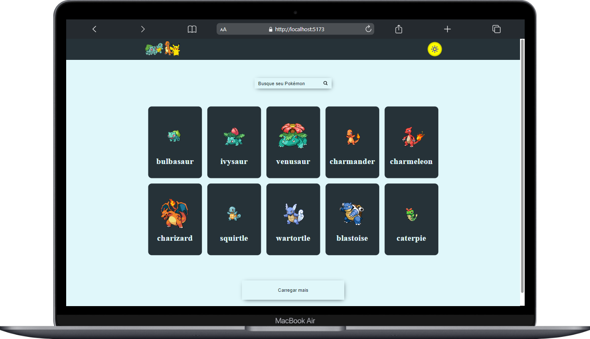
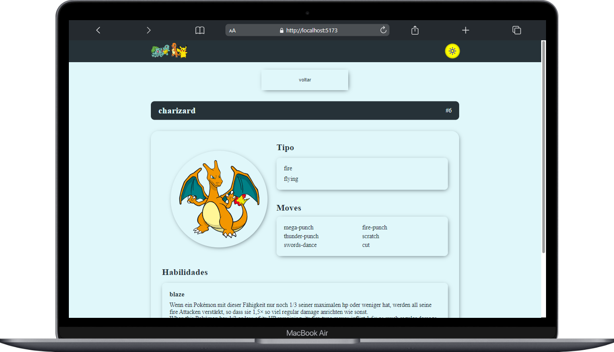

# Projeto Pokemon

Uma web page interativa usando uma API de Pokemon's!

## Documentação

- [Documentação](#)
- [Sobre o projeto](#sobre-o-projeto)
- [Design System](#design-system)
- [Objetivos principais](#objetivos-principais)
- [Tecnologias principais](#tecnologias-principais)
- [Aplicação](#aplicação)
- [Desafios](#desafios)
- [Desenvolvedor](#desenvolvedor)
- [Deploy](#deploy)
- [Executando o projeto localmente](#executando-o-projeto-localmente)

## Sobre o projeto

Esse desafio faz parte do curso DevQuest, ele serve para simular um teste técnico que pode ser pedido em um processo seletivo de frontend !

## Objetivos principais

Desenvolver uma webpage que inicialmente mostra uma lista de 10 Pokemon's na tela inicial, com um botão de buscar mais abaixo da lista que ao ser clicado ele busca e apresenta mais 10 Pokemon's a essa listagem. Deve também cada pokemon ser clicável levando o usuário para uma página onde mostra o pokemon selecionado detalhadamente! 

### Tela Inicial (Home)

- Botão de temas com alterações entre light e dark
- Campo de Busca 
- Após buscar, mostrar as informações que o usuário buscou 
- Listagem de 10 Pokemon's
- Botão para carregar e adicionar mais 10 Pokemon's a essa lista

### Pokemon Detalhado

- Botão de temas com alterações entre light e dark
- Informações como nome, moves, habilidades, foto e id  do Pokemon selecionado 

## Design System

Utilizei alguns conceitos e ferramentas para padronizar várias etapas do projeto.

- **Aplicação das regras e padrões**: ESLint
- **Formatação automática com base nas regras**: Prettier

## Tecnologias Principais

## Aplicação

### Telas de Desktop

  
  

## Desafios

 - Manipulação de API

## Desenvolvedor

<table align="center">
    <tr>
        <td align="center">
            

                 
                    <b> Kelvin Charles  </b> 
                        
                        
            

        </td>
    </tr>
</table>

## Deploy

> https://projeto-mundo-real-fetch-api-github.vercel.app/

## Executando o projeto localmente

> Projeto iniciado usando create vite@latest.

- Clone o projeto com

  > git clone https://github.com/kelvincharlesdev/projeto-mundo-real-fetch-api-github.git

- Vá para a raiz do diretório

  >  cd pokemons-list/

- Instale as dependências

  > npm install

- Inicie o servidor local

  > npm run dev